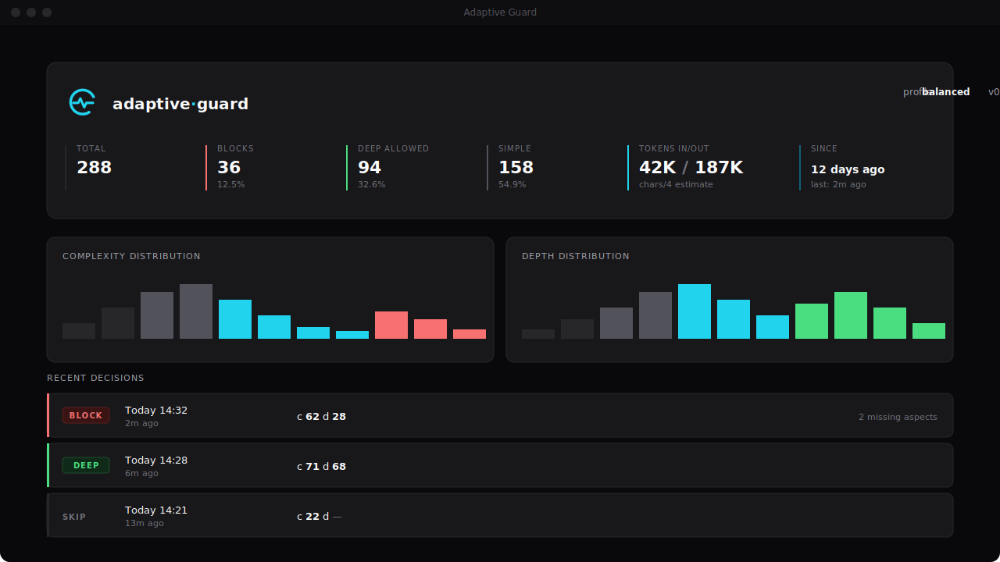

<p align="center">
  
</p>

<p align="center">
  <strong>Live telemetry for every Claude Code decision.</strong><br>
  A Stop-hook that catches surface-level responses and forces the model to reconsider with more depth.
</p>

<p align="center">
  <a href="https://github.com/Sthiven-R/claude-code-adaptive-guard/blob/main/LICENSE"></a>
  <a href="https://github.com/Sthiven-R/claude-code-adaptive-guard/releases"></a>
  <a href="https://github.com/Sthiven-R/claude-code-adaptive-guard/actions/workflows/check.yml"></a>
</p>

<p align="center">
  
  <br>
  <sub><i>Provisional mock — replaced with a real screenshot once the desktop bundle is built. See <a href="assets/README.md">assets/README.md</a>.</i></sub>
</p>

---

## What it is

Claude Opus 4.7 ships with a feature called **adaptive thinking**: the model decides on its own how much to think before responding, based on the perceived difficulty of the task.

In theory, great. In practice, the internal router that makes that decision misjudges complexity on a regular basis. You end up with shallow, surface-level responses to tasks that clearly deserved deeper analysis.

> **Validated externally:** On 2026-04-23 Anthropic [published a post-mortem](https://www.anthropic.com/engineering/april-23-postmortem) admitting that three product-layer regressions silently degraded Claude Code response depth between March 4 and April 20 — including a default `effort` cut from `high` to `medium` that they call out as "the wrong tradeoff." Adaptive-guard measures response depth from outside the harness, so it catches this kind of silent regression without depending on Anthropic's own evals.

`adaptive-guard` is a Stop hook for Claude Code that:

1. Reads the last user prompt and assistant response
2. Scores the prompt's **complexity** and the response's **depth**
3. If the prompt was complex but the response was shallow, **blocks the stop** and tells Claude what specifically needs more analysis

The result: Claude gets a second chance with explicit feedback — the same mechanism a thoughtful code reviewer would use.

It ships with a **native desktop dashboard** (Tauri + Svelte) that watches the telemetry file in real time, so every decision is observable as it happens.

---

## What it does NOT do (honest)

- It does **not** disable adaptive thinking. That is not possible in Opus 4.7.
- It does **not** guarantee deep responses on every turn. The router still decides.
- It does **not** activate on trivial prompts by design. "What time is it?" never triggers a re-prompt.

What it **does** is significantly increase the probability that complex tasks receive the depth they deserve.

---

## Design principles

The guard is built on three non-negotiables:

- **No hardcoded keyword lists.** Scoring uses structural signals (length, markdown density, technical-token patterns, sentence variance, lexical diversity) that are language-agnostic by construction. An optional embedding layer adds semantic comparison against prototype anchors, not word matches.
- **Fail-open.** Any error in the guard results in allowing the stop. The guard is a quality tool, never a blocker.
- **Zero runtime dependencies in the fast path.** Python standard library only for baseline operation. Semantic scoring is opt-in via a lightweight ONNX package.

---

## Requirements

- Claude Code `v2.1.111` or later
- Python 3.8+
- Bash (Linux, macOS, or WSL/Git Bash on Windows)

Optional (for semantic scoring):
- `fastembed>=0.3.0` — ~100 MB (ONNX runtime + multilingual model)

---

## Install

### Option A — clone and run (recommended for now)

```bash
git clone https://github.com/Sthiven-R/claude-code-adaptive-guard.git
cd claude-code-adaptive-guard
./scripts/setup-global.sh   # makes `adaptive-guard` available from any shell
adaptive-guard install      # writes the Stop hook to ~/.claude/settings.json
```

Restart Claude Code. The hook now runs on every Stop event.

### Option B — download the desktop bundle

Pre-release `.msi` (Windows), `.dmg` (macOS universal) and `.AppImage` (Linux) bundles are produced by CI on every tag and attached to the [GitHub Releases](https://github.com/Sthiven-R/claude-code-adaptive-guard/releases) page. Bundles are currently **unsigned** — first run shows the standard platform warning (SmartScreen on Windows, Gatekeeper on macOS) which can be bypassed once. Cloning + setup-global is still required for the CLI itself.

### Enable semantic scoring (optional)

```bash
pip install -r requirements-optional.txt
```

With `fastembed` installed, the guard blends structural and semantic scores for higher precision. Without it, only structural scoring is used.

**Cold-start cost (honest):** Claude Code spawns a fresh Python process per Stop event, so the embedding model (`paraphrase-multilingual-MiniLM-L12-v2`, ~120 MB ONNX) re-initializes on every turn. First-ever invocation downloads the model (≈30 s on a typical link); subsequent turns reload from disk cache (~100–300 ms). Pure structural scoring (default, without `fastembed`) is sub-50 ms per turn. If sub-second cold-start matters, leave the optional layer disabled — a persistent-daemon mode is on the v0.2 roadmap.

### Profiles

Three profiles ship by default:

| Profile | Use case | Complexity bar | Depth bar |
|---|---|---|---|
| `balanced` (default) | Most users | 40 | 40 |
| `strict` | Aggressive enforcement | 30 | 55 |
| `lenient` | Minimal intervention | 55 | 30 |

Switch profile:

```bash
./scripts/install.sh --profile strict
```

### Uninstall

```bash
./scripts/uninstall.sh
```

Your `settings.json` is backed up with a timestamp before any change.

---

## How it works

```
Claude finishes a response (Stop event)
          │
          ▼
   Claude Code invokes adaptive-guard with JSON on stdin:
     { session_id, transcript_path, last_assistant_message, ... }
          │
          ▼
   analyze.py uses last_assistant_message directly from input
   and parses transcript_path to recover the prior user prompt
          │
          ▼
   complexity.py scores the user prompt  (structural + optional semantic)
          │
     ≥ threshold? ── no ──▶ allow stop (exit 0, empty stdout)
          │ yes
          ▼
   depth.py scores the assistant response  (structural + optional semantic)
          │
     ≥ threshold? ── yes ──▶ allow stop (exit 0, empty stdout)
          │ no
          ▼
   detect_missing_aspects() identifies structural gaps
          │
          ▼
   Emit JSON { decision: "block", reason: "..." } on stdout
   (Claude Code feeds `reason` back to Claude as context
   for the forced continuation)
```

### Hook output contract

The guard uses the modern Stop-hook contract: JSON on stdout with `exit 0`.

```json
{
  "decision": "block",
  "reason": "[adaptive-guard] Your previous response appears surface-level..."
}
```

Verified against the Claude Code CLI schema. Note that `hookSpecificOutput` is NOT a valid field for Stop events (it only applies to PreToolUse / UserPromptSubmit / PostToolUse) — including it would cause schema validation to fail.

### Scoring axes

**Complexity** (prompt):
- Length (chars normalized)
- Question density and multi-part structure
- Compound-request signals (sentence count, commas, semicolons)
- Technical-token density: camelCase, snake_case, dotted identifiers,
  acronyms, mixed-case brand names, proper nouns mid-sentence, version
  numbers, inline code
- External references: paths, URLs, code blocks

**Depth** (response):
- Length relative to prompt
- Heading structure (markdown `##`, `###`, etc. — deduplicated)
- List and table structure
- Code blocks and inline code
- Lexical diversity (type-token ratio)
- Sentence-length variance (flat lists vs. varied prose)

**Optional semantic layer** (when fastembed installed):
- Cosine similarity vs. anchor prompts (complex vs. simple prototypes)
- Cosine similarity vs. anchor responses (deep vs. shallow prototypes)
- Blended with structural score (0.65 semantic / 0.35 structural for complexity;
  0.55 / 0.45 for depth)

All scoring parameters are language-agnostic: the structural path works on any language, and the semantic path uses a multilingual embedding model.

---

## Desktop dashboard

A native Tauri + Svelte 5 window that reads `~/.claude/telemetry/adaptive-guard.jsonl` and re-renders every decision the moment it lands.

**Features:**
- Live file watching — new decisions appear within ~1 second.
- Per-decision breakdown: every score axis, every detected signal.
- Filter by decision type, session id prefix, or time range.
- Histograms of complexity / depth distributions across all recorded decisions.
- System tray integration — close window minimizes to tray; the watcher keeps running.
- First-run welcome flow with one-click hook install (writes `~/.claude/settings.json` with timestamped backup).
- Bilingual UI: English / Español, switchable from the gear menu, persisted across launches. Default detected from your OS locale.
- Theme toggle: Dark, Light, or Auto (follows `prefers-color-scheme`). Persisted across launches.

<!--
  Welcome / settings screenshots will land here once the operator
  captures them from the built bundle. Holding off on placeholders
  to keep the rendered README clean — the hero illustration above
  already carries the visual weight.
-->


### Launch the dashboard

```bash
adaptive-guard dashboard
```

Resolution order:

1. Pre-built release binary at `dashboard/src-tauri/target/release/...` if present.
2. Dev mode (`npm run tauri dev`) if `node_modules` is installed.
3. Otherwise, prints actionable instructions.

Most users never need this command — once a release is installed via `.msi` / `.dmg` / `.AppImage`, the app appears in your start menu / Applications folder.

### Build the dashboard from source

```bash
cd dashboard
npm install
npm run tauri build
```

Outputs platform-specific bundles under `src-tauri/target/release/bundle/`.

---

## Telemetry and inspection

The guard logs one line per decision to `~/.claude/telemetry/adaptive-guard.jsonl`. Each line includes the full axis-by-axis breakdown so every decision is reconstructable.

**No prompt content or response content is ever logged** — only integers, score totals, and counts of detected technical patterns (e.g. "3 dotted identifiers", "1 inline code block"). Matched substrings are never stored: those routinely contain user secrets, and counts are sufficient to explain a score.

Disable telemetry in `config/default.json`:

```json
{
  "telemetry_enabled": false
}
```

### Inspect decisions

```bash
./scripts/stats.sh                # summary of all decisions
./scripts/stats.sh --recent 20    # last N decisions
./scripts/stats.sh --today        # only today
./scripts/stats.sh --last         # FULL breakdown of the most recent decision
./scripts/stats.sh --last 5       # full breakdowns of the last 5
./scripts/stats.sh --session X    # all decisions from a specific session
```

### Simulate a scoring before a real turn

```bash
./scripts/explain.sh
```

Paste any prompt (and optionally a response). Get the same breakdown the guard would record if this were a real turn. The output shows every axis contribution and every detected signal — so you can calibrate the thresholds to your own criterion without guessing.

Detailed scoring specification: see [docs/SCORING.md](docs/SCORING.md).

---

## Anti-loop safety

- The `stop_hook_active` flag is checked on every invocation. If Claude is already in a forced-continuation state from a prior block, the guard exits immediately.
- `max_retries` is capped in config (default: 2).
- Fail-open: if the guard errors for any reason, it exits 0 (allow stop).

---

## Testing

```bash
ADAPTIVE_GUARD_TELEMETRY_DISABLED=1 python -m pytest tests/ -q
```

(The same command CI runs in `.github/workflows/check.yml`.)

Tests cover: structural scoring with breakdown verification, wrapper scoring, missing-aspect detection, transcript parsing, end-to-end subprocess invocation, and regression tests for prior audit findings (path traversal rejection, template-injection protection, deep-merge profiles, schema-compliant output, fail-open under unexpected exceptions, etc.).

Setting `ADAPTIVE_GUARD_TELEMETRY_DISABLED=1` prevents tests from writing to your production telemetry file.

---

## Roadmap

- **v0.1** (current) — Structural + optional semantic scoring, native desktop dashboard with live watcher, system tray integration, bilingual UI (en/es), in-app install/uninstall, dark / light / auto theme toggle, multi-OS bundles via CI.
- **v0.2** — Code-signed releases (Authenticode + Apple Developer ID), auto-updater, per-project config (detect context from repo path), expanded anchor sets.
- **v0.3** — Local LLM judge for edge cases the embedder misclassifies, decision export (CSV/JSON), keyboard shortcuts, command palette.

---

## Privacy and compliance

This is a personal-use tool. Data flow is bounded:

- **Reads:** stdin (Stop hook payload from Claude Code), the session transcript file under `~/.claude/projects/...` for the prior user prompt, and `~/.claude/settings.json` on install/uninstall.
- **Writes:** `~/.claude/telemetry/adaptive-guard.jsonl` (integers, score totals, and counts — never prompt or response text), and `~/.claude/settings.json` (only the hook entry, with a timestamped backup created before any modification).
- **Network:** none. The tool never opens an outbound connection. The optional `fastembed` package downloads its model file once on first use; subsequent runs are fully offline.

**No formal compliance regime applies** (GDPR, HIPAA, PCI-DSS, SOC 2, MiFID II, etc.) because the tool runs locally, processes only the operator's own data, and never transmits or aggregates across users. If you operate in a regulated environment with strict data-residency rules for prompt/response content, those rules concern Claude Code itself (the upstream tool) — `adaptive-guard` reads the same on-disk transcript Claude Code already maintains and persists only score numbers derived from it.

---

## License

MIT — see [LICENSE](LICENSE).

---

## Why this exists

Because surface-level responses on complex tasks are the single biggest frustration of working with Claude Code at depth. The fix isn't a better prompt — it's a feedback loop between turns.

Built by [@Sthiven_R](https://x.com/Sthiven_R).
